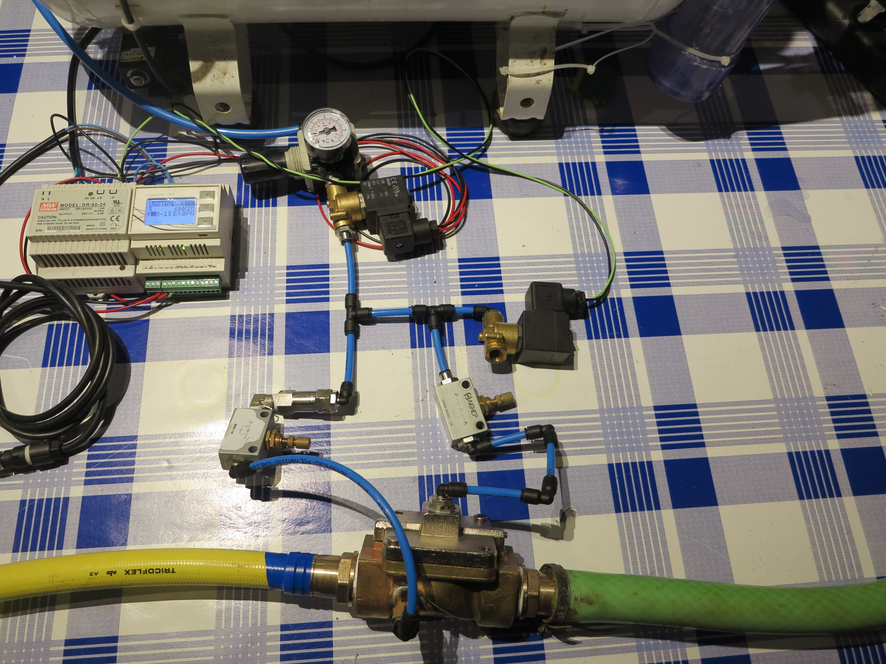

# Arnastu

A Open Source compressor based ventilator.

# UK Goverment Specs for a rapidly manufactured ventilator system

https://www.gov.uk/government/publications/coronavirus-covid-19-ventilator-supply-specification/rapidly-manufactured-ventilator-system-specification

# Project Overview 

This project aims to buil a open source ventilator system for emergency breathing support. It doesn't aim to be a certified ventilator, only a fully funtional one.

The system is based on the following assumptions:

* Electrical Power Availability
* Medical Grade Compressed Air Availability
* O2 availability

The system is built with commont pneumatic parts, the only custom part is the big bronze valve, which have been modified to be actuated pneumatically instead of electrically.

This is the big photo of the system:

The main pneumatic circuit is the folowing one:

# PEEP Pressure

The patient needs to have a positive pressure always, something like 20 mmH20, this is achieved using the water bubbler

* Must have mandatory ventilation (DONE)
* Pressure Support mode (To Do)

* Plateau pressure should adapt to achieve volume and be limited to 35 cmH2O (To Do)
* Peak pressure should be no more than 2 cmH2O greater than plateau pressure (To Do)
* Ideally there should be a mechanical failsafe valve that opens at 40 cmH2O (Via Water Column)

* Range 5 to 25 cm H2O adjustable in 5 cmH2O increment (DONE)
* Patient breathing system must remain pressurised to at least the PEEP level setting at all times (DONE)

* Inspiratory:Expiratory ratio (I:E) (note, confusingly, it is actually E/I time) adjustable form 1.0-3.0 (To Do)

* Range 10 to 30 breaths per minute in increments of 2 (only in mandatory mode) can be set by the user (To Do)

## Tidal Volume (Vt). The volume of gas flowing into the lungs during one inspiratory cycle:

* must have at least one setting of 400ml +/- 10 ml
* ideally 350ml and 450 ml options
* optionally Range 250 to 600 ml in steps of 50ml
* even more optionally up to 800 ml
* optionally the ability to input body weight and have volume calculated as, for example, 6ml/kg of ideal body weight

## Gas and electricity

### Incoming gas supply:

* all gas connectors and hoses must use standard non-interchangeable connectors and be colour coded according to current standards
* must connect to wall pipeline oxygen supply via Schrader valve connector (BS 5682, not the bicycle wheel version). If hose not permanently fixed to machine, then must connect with NIST (Non-Interchangeable Screw Thread – ISO 10802). Oxygen pipeline pressure is 4 to 5 Bar
* optionally can incorporate a backup oxygen cylinder connected via either Schrader valve or Pin Index System
* must be able to be operated on any attached cylinders. Oxygen cylinder pressure is either 1 to 137 bar if no regulator is fitted, or 4 bar if the cylinder incorporates a pressure regulator. The ventilator must be able to work with either. The ventilator must include a pressure regulator to decrease 137 bar cylinder pressure to 4 bar working pressure. Working pressure inside the ventilator may be up to 4 bar, but it must be impossible to expose the patient to any pressure above 40 cmH2O
* optionally can connect to wall pipeline medical air via Schrader valve (NB ‘medical air’ is 4 bar. Must not connect to ‘surgical air 7 bar’ supply)
* optionally can connect to Anaesthetic Gas Scavenging System
* optionally can operate using an oxygen concentrator device for input oxygen

### Electricity supply

* should connect to 240V mains
* battery backup – see below. Must have 20 minutes backup battery in case of mains electricity failure
* optionally hot swappable batteries so that it can be run on battery supply for an extended period, for example, 2 hours for within hospital transfer
* must avoid harmful RF or EM emissions that could interfere with other critical machinery

### Gas supply to patient:

* user must be able to control inspired oxygen proportion (FiO2). The percentage of oxygen in the gas being breathed in by the patient. Room air is 21% oxygen
* at least 50% and 100% options
* very preferably ideally variable between 30 and 100% in 10% steps
* patient breathing system connections: the ventilator must present 22mm outside diameter (OD) ‘male’ standard connectors for connection to user supplied 22mm ‘female’ connectors on the breathing system
* All elements in the gas pathway must meet biological safety and oxygen safety standards, especially to minimise risk of fire or contamination of the patient’s airway.

## Must alarm at:

* gas or electricity supply failure
* machine switched off while in mandatory ventilation mode
* inspiratory airway pressure exceeded
* inspiratory and PEEP pressure not achieved (equivalent to disconnection alarm)
* tidal volume not achieved or exceeded

## Monitoring
The following should be continuously displayed so the user can verify:

* current settings of tidal volume, frequency, PEEP, FiO2, ventilation mode
* actual achieved rates of tidal volume, breathing rate, PEEP, plateau pressure, FiO2
* if it exists, in pressure support mode there must be real-time confirmation of each patient breath and an alarm if below acceptable range
* optionally CO2 monitoring included

## Miscellaneous
* Must be reliable. It must have 100% duty cycle for up to 14 days.

# TODOs

* Better automatization
* Detect if the patient inspires and help him/her, needs a pressure sensor